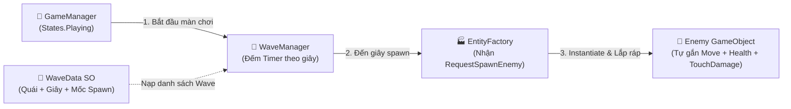
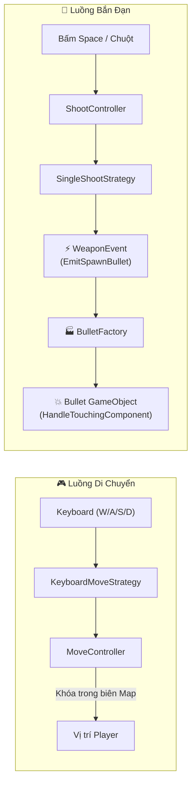
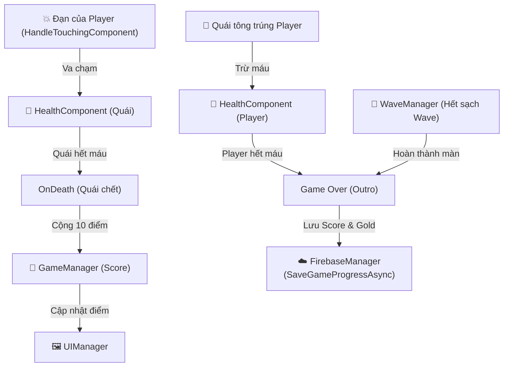

# 🌌 TESTINGSDK — GAME ARCHITECTURE & SYSTEM BLUEPRINT
> **Tài liệu bàn giao kiến trúc kỹ thuật dành cho AI & Nhà phát triển (AI-Ready Technical Documentation)**
> *Dự án*: 3D Top-down / Isometric Space Shooter  
> *Engine*: Unity C# (Data-Driven, Strategy Pattern, Event-Driven, Factory Pattern)

---

## 📑 MỤC LỤC
1. [Tổng Quan & Triết Lý Thiết Kế](#1-tổng-quan--triết-lý-thiết-kế)
2. [Vòng Lặp Trò Chơi (Core Game Loop)](#2-vòng-lặp-trò-chơi-core-game-loop)
3. [Sơ Đồ Kiến Trúc Toàn Cảnh (Architectural Diagrams)](#3-sơ-đồ-kiến-trúc-toàn-cảnh-architectural-diagrams)
4. [Bản Đồ File & Trách Nhiệm Chi Tiết (File Directory Map)](#4-bản-đồ-file--trách-nhiệm-chi-tiết-file-directory-map)
5. [Cấu Trúc Dữ Liệu & Hợp Đồng Giao Tiếp (Data Contracts)](#5-cấu-trúc-dữ-liệu--hợp-đồng-giao-tiếp-data-contracts)
6. [Cơ Chế Chiến Đấu, Máu & Sát Thương (Combat & Damage Pipeline)](#6-cơ-chế-chiến-đấu-máu--sát-thương-combat--damage-pipeline)
7. [Hướng Dẫn Mở Rộng Tính Năng (Extensibility Guide)](#7-hướng-dẫn-mở-rộng-tính-năng-extensibility-guide)

---

## 1. TỔNG QUAN & TRIẾT LÝ THIẾT KẾ

Dự án được xây dựng dựa trên 4 mẫu thiết kế phần mềm cốt lõi:

```
┌────────────────────────────────────────────────────────────────────────┐
│ 1. DATA-DRIVEN ARCHITECTURE (ScriptableObjects)                        │
│    - Dữ liệu tách rời hoàn toàn khỏi Logic code.                       │
│    - Quái vật (EntityData), Màn chơi (WaveData), Tàu (BaseStat).       │
├────────────────────────────────────────────────────────────────────────┤
│ 2. STRATEGY PATTERN (Hành vi động)                                     │
│    - IMoveStrategy: Thay đổi cách bay (Bàn phím, Rơi thẳng, Zíc-zắc).  │
│    - IShootStrategy: Thay đổi cách bắn (Tia đơn, Tia chùm, Laze).     │
├────────────────────────────────────────────────────────────────────────┤
│ 3. EVENT-DRIVEN BUS (Hệ thống sự kiện tách rời)                        │
│    - GameEvents & WeaponEvent: Giao tiếp lỏng lẻo (Decoupled)          │
│    - Command-Notification: Request... (Yêu cầu) -> On... (Thông báo)   │
├────────────────────────────────────────────────────────────────────────┤
│ 4. FACTORY PATTERN (Xưởng khởi tạo)                                    │
│    - EntityFactory & BulletFactory: Tự động lắp ráp và bơm Data (Init).│
└────────────────────────────────────────────────────────────────────────┘
```

---

## 2. VÒNG LẶP TRÒ CHƠI (CORE GAME LOOP)

```text
[LOBBY / SETUP]
  ├── FirebaseManager tải PlayerData (Score kỷ lục, Gold, ShipIDs sở hữu).
  └── WeaponConfigurationUI duyệt BaseStat -> Bấm Apply -> GameEvents.RequestChangeShip(curStat).

[GAMEPLAY START]
  ├── UI bấm Play -> GameEvents.RequestChangeGameStates(States.Intro) & RequestSpawnPlayer().
  ├── EntityFactory khởi tạo Tàu người chơi -> tiêm trực tiếp player.Init(curBaseStat).
  └── GameManager chuyển sang States.Playing -> kích hoạt WaveManager.GetStage(curStage).

[COMBAT & SPAWN WAVE]
  ├── WaveManager quét timeline WaveData theo từng giây -> GameEvents.RequestSpawnEnemy(entityData, spawnPos).
  ├── EntityFactory sinh Quái (gắn HealthComponent, MoveController + FallDownStrategy, HandleTouchingComponent).
  ├── Player nhấn Space/Chuột -> ShootController -> SingleShootStrategy phát WeaponEvent.EmitSpawnBullet.
  └── BulletFactory sinh Bullet bay theo trục Z -> mang theo damage vào HandleTouchingComponent.

[DAMAGE & SCORE]
  ├── Đạn chạm Quái: HandleTouchingComponent của Đạn trừ máu HealthComponent của Quái.
  ├── Quái hết máu: HealthComponent gọi Die() -> GameManager cộng 10 điểm -> UIManager cập nhật.
  └── Quái chạm Player: HandleTouchingComponent của Quái trừ máu HealthComponent của Player.

[STAGE END & CLOUD SYNC]
  ├── WaveManager hết toàn bộ Wave -> báo OnEndStage -> GameManager sang States.Outro.
  └── GameManager gọi FirebaseManager.SaveGameProgressAsync(score, gold) -> Lưu kỷ lục lên mây.
```

---

## 3. SƠ ĐỒ KIẾN TRÚC TOÀN CẢNH (ARCHITECTURAL DIAGRAMS)

### 🚀 SƠ ĐỒ 1: CHỌN TÀU & KHỞI TẠO PLAYER (LOBBY $\rightarrow$ PLAY)
```mermaid
flowchart LR
    UI["🖼️ WeaponConfigurationUI<br/>(Bấm Next / Apply)"]
    GE["⚡ GameEvents<br/>(RequestChangeShip)"]
    EF["🏭 EntityFactory<br/>(RequestSpawnPlayer)"]
    PE["🚀 PlayerEntity<br/>(Tạo tàu + Gắn Component)"]
    GM["👑 GameManager<br/>(Chuyển sang Playing)"]

    UI -->|1. Chọn tàu & Bấm Apply| GE
    GE -->|2. Gửi BaseStat của tàu| EF
    UI -->|3. Bấm Play| EF
    UI -->|3. Bấm Play| GM
    EF -->|4. Instantiate & Bơm data Init()| PE
```

### 🌊 SƠ ĐỒ 2: QUẢN LÝ WAVE & SPAWN QUÁI


### 🎮 SƠ ĐỒ 3: DI CHUYỂN & BẮN ĐẠN (INPUT & SHOOTING)


### 💥 SƠ ĐỒ 4: VA CHẠM, TÍNH ĐIỂM & ĐỒNG BỘ CLOUD


---

## 4. BẢN ĐỒ FILE & TRÁCH NHIỆM CHI TIẾT

Toàn bộ mã nguồn cốt lõi nằm trong `Assets/SCript/`:

### 📡 Trạm Sự Kiện (Event Bus)
* **`GameEvents.cs`**: Trạm trung gian tĩnh phát các sự kiện toàn cục:
  * `RequestChangeShip` / `OnShipChanged`: Đổi cấu hình tàu.
  * `RequestChangeGameStates` / `OnChangeGameStates`: Đổi trạng thái trận đấu.
  * `RequestSpawnPlayer` / `OnSpawnPlayer`: Ra lệnh sinh tàu người chơi.
  * `RequestSpawnEnemy`: Ra lệnh cho Factory sinh quái.
* **`WeaponEvent.cs`**: Định nghĩa `struct BulletSpawnData` (prefab, position, speed, damage) và event `OnRequestSpawnBullet`.

### 🎛️ Bộ Điều Khiển Chính (Core Managers)
* **`GameManager.cs`**: Máy trạng thái FSM (`Intro`, `Playing`, `Outro`, `Pause`), lưu giữ `score`, `gold`. Kích hoạt `WaveManager.GetStage()`.
* **`WaveManager.cs`**: Máy trạng thái Wave FSM (`WaveIntro`, `WaveCombat`, `WaveOutro`, `StageEnd`). Đếm timeline `waveTimer` để phát lệnh spawn quái từ mảng `spawnPointArray`.
* **`FirebaseManager.cs`**: Singleton kết nối Firebase Auth (ẩn danh) và Realtime Database. Tải và lưu `PlayerData` (`highestScore`, `gold`).
* **`UIManager.cs`**: Lắng nghe `GameManager` để hiển thị chữ thông báo trạng thái và điểm số.

### 🏭 Nhà Máy Khởi Tạo (Factories)
* **`EntityFactory.cs`**:
  * `SpawnPlayer()`: Tạo tàu người chơi và tiêm dữ liệu trực tiếp: `player.Init(curBaseStat)`.
  * `Spawn(entityData, spawnPos)`: Tạo quái, tự động gắn `HealthComponent`, `HandleTouchingComponent`, `MoveController` (`FallDownStrategy`), và gán LayerMask.
* **`BulletFactory.cs`**: Nghe `WeaponEvent.OnRequestSpawnBullet` $\rightarrow$ Instantiate đạn $\rightarrow$ gán `speed` cho `Bullet` và `damage` cho `HandleTouchingComponent`.

### 🚀 Thực Thể Nhân Vật & Vũ Khí (Player & Weapons)
* **`PlayerEntity.cs`**: Đại diện cho phi thuyền người chơi. Lấy component tại `Awake()` và nhận dữ liệu qua `Init(BaseStat)`.
* **`MoveController.cs`**: Nhận `IMoveStrategy` để tính vector hướng và dùng `Mathf.Clamp` khóa vị trí trong map.
* **`ShootingController.cs`**: Bắt phím Space/Chuột trái theo `fireRate` $\rightarrow$ gọi `IShootStrategy.Shoot()`.
* **`WeaponConfigurationUI.cs`**: Giao diện chọn tàu trong Lobby. Bấm Apply $\rightarrow$ gửi `GameEvents.RequestChangeShip`, Bấm Play $\rightarrow$ gửi `RequestSpawnPlayer`.
* **`GetFirePoint.cs`**: Đánh dấu vị trí đầu nòng súng trên Prefab tàu.

### 🧠 Chiến Lược (Strategy Pattern Implementations)
* **Di chuyển (`IMoveStrategy`)**:
  * `KeyboardMoveStrategy.cs`: Đọc W/A/S/D cho Player.
  * `FallDownStrategy` (trong `KeyboardMoveStrategy.cs`): Bay thẳng xuống (`Vector3.back`) cho Quái/Thiên thạch.
  * `MouseMoveStrategy.cs`: Bản vẽ sẵn cho điều khiển chuột/cảm ứng.
* **Bắn súng (`IShootStrategy`)**:
  * `SingleShootStrategy.cs`: Đóng gói dữ liệu bắn 1 tia thẳng về phía trước.

### 💥 Hệ Thống Sát Thương & Máu (Combat Components)
* **`HealthComponent.cs`** (Implements `IDamageable`): Quản lý máu `health`, `maxHealth`. Khi nhận `TakeDamage()` $\rightarrow$ nếu HP $\le 0$ thì gọi `Die()` $\rightarrow$ kích hoạt `OnDeath` và `Destroy(gameObject)`.
* **`HandleTouchingComponent.cs`**: Component gây sát thương khi va chạm (`OnTriggerEnter`). Được gắn trên **Viên Đạn** (để bắn quái) và trên **Quái** (để húc Player).
* **`Bullet.cs`**: Điều khiển đạn bay thẳng trục Z và tự hủy sau 3 giây hoặc khi va chạm.

### 🛠️ Công Cụ Editor (Custom Windows)
* **`WaveMasterWindow.cs`** (Menu: `Tools > Wave Master Editor`): Cửa sổ thiết kế Wave trực quan 2 cột (Cột trái: mảng Stage & 8 cổng spawn; Cột phải: timeline kéo thả quái theo giây và Live Cheat runtime).

---

## 5. CẤU TRÚC DỮ LIỆU (DATA CONTRACTS)

### 1. Phân Tầng Quái & Màn Chơi (Data-Driven Hierarchy)
```text
[EntityData] (ScriptableObject)
   ├── string enemyName
   ├── int maxHealth = 50
   ├── float moveSpeed = 5
   ├── int touchDamage = 15
   ├── Category category (Enemy / Obstacle)
   └── GameObject prefab

        ▼ Đóng gói bối cảnh
[WaveElement] (struct)
   ├── EntityData entity
   ├── float spawnTime (giây xuất hiện, ví dụ 2.5s)
   └── int spawnPointIndex (cổng spawn từ 0 đến 7)

        ▼ Gom danh sách
[WaveData] (ScriptableObject)
   ├── string waveName
   └── List<WaveElement> waveList

        ▼ Gom thành màn chơi
[Stages] (struct trong GameManager)
   └── WaveData[] waveList
```

### 2. Cấu Hình Tàu Người Chơi (`BaseStat`)
```csharp
public class BaseStat : ScriptableObject
{
    public string name;
    public int id;
    public int maxHealth;
    public GameObject skinPrefab;
    public float moveSpeed;
    public SpaceShipType shipType;
    public Sprite sprite;
}
```

---

## 6. CƠ CHẾ CHIẾN ĐẤU, MÁU & SÁT THƯƠNG

### Sự Phân Chia Rõ Rệt Giữa 2 Component:
1. **`HealthComponent` = CỘT MÁU (Nạn nhân)**:
   * Được gắn trên: **Player** và **Quái / Thiên Thạch**.
   * Đảm nhiệm: Chứa máu, nhận hàm `TakeDamage(int amount)`, kích hoạt `Die()`.
2. **`HandleTouchingComponent` = BỘ GÂY SÁT THƯƠNG (Kẻ tấn công)**:
   * Được gắn trên: **Viên Đạn** (mang damage của súng) và **Quái** (mang touchDamage).
   * Đảm nhiệm: Khi chạm mục tiêu có `HealthComponent` $\rightarrow$ gọi `health.TakeDamage(damage)`.

---

## 7. HƯỚNG DẪN MỞ RỘNG TÍNH NĂNG (EXTENSIBILITY GUIDE)

### A. Thêm Kiểu Di Chuyển Mới Cho Quái (Ví Dụ: Bay Zíc-Zắc)
1. Tạo class mới kế thừa `IMoveStrategy`:
```csharp
public class ZigZagMoveStrategy : IMoveStrategy
{
    public Vector3 GetTargetDirection()
    {
        float sinX = Mathf.Sin(Time.time * 5f) * 1.5f;
        return new Vector3(sinX, 0f, -1f).normalized;
    }
}
```
2. Trong `EntityFactory.ClassifyMoving()`, gán strategy này cho loại quái tương ứng.

### B. Thêm Kiểu Bắn Mới Cho Player (Ví Dụ: Bắn 3 Tia Chùm - Spread Shot)
1. Tạo class mới kế thừa `IShootStrategy`:
```csharp
public class TripleShootStrategy : IShootStrategy
{
    public void Shoot(Vector3 spawnPosition, GameObject bulletPrefab, float bulletSpeed)
    {
        float[] angles = { -15f, 0f, 15f };
        foreach (float angle in angles)
        {
            Vector3 dir = Quaternion.Euler(0f, angle, 0f) * Vector3.forward;
            BulletSpawnData data = new BulletSpawnData
            {
                prefab = bulletPrefab,
                position = spawnPosition,
                speed = bulletSpeed,
                damage = 15f
            };
            WeaponEvent.EmitSpawnBullet(data);
        }
    }
}
```
2. Gọi `shootController.ChangeShootStrategy(new TripleShootStrategy())` khi nhặt được vật phẩm nâng cấp!

---
*Tài liệu này phản ánh chính xác cấu trúc thực tế của codebase tại `D:\thang\TestingSDK`.*
